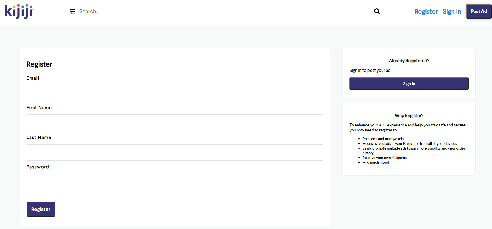
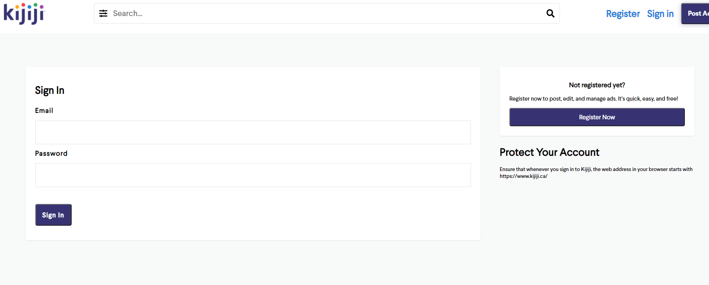
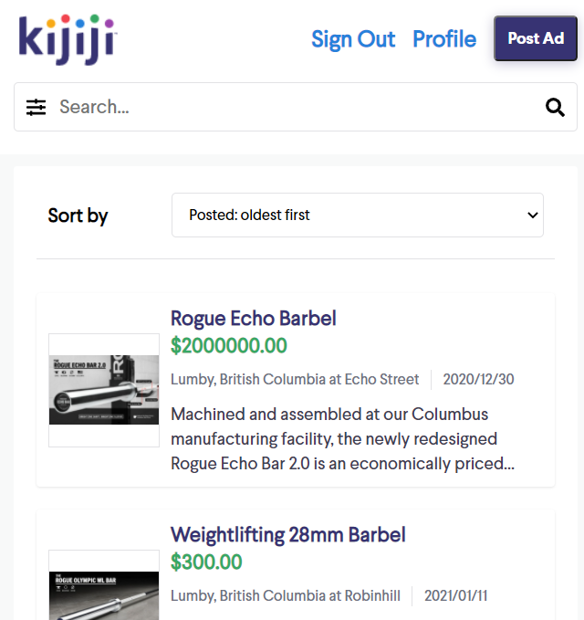
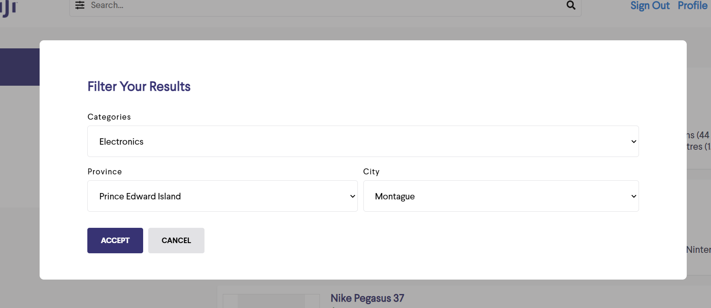
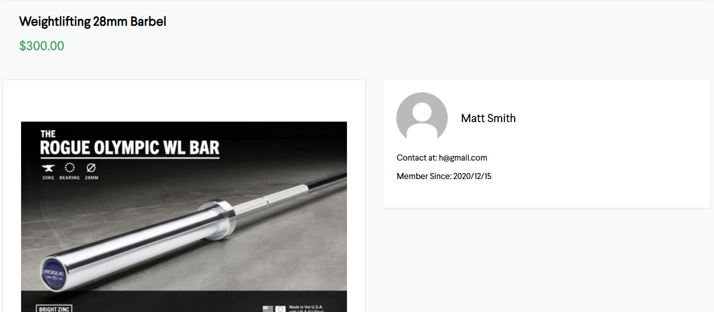
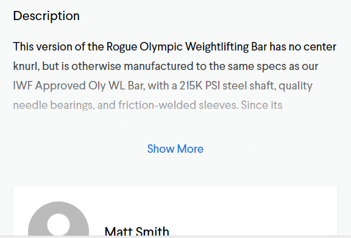
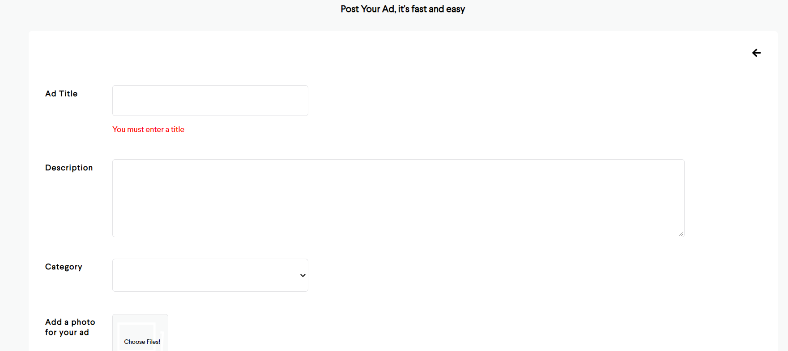
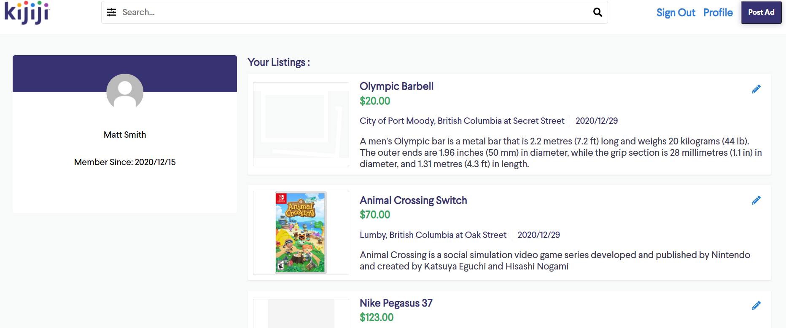
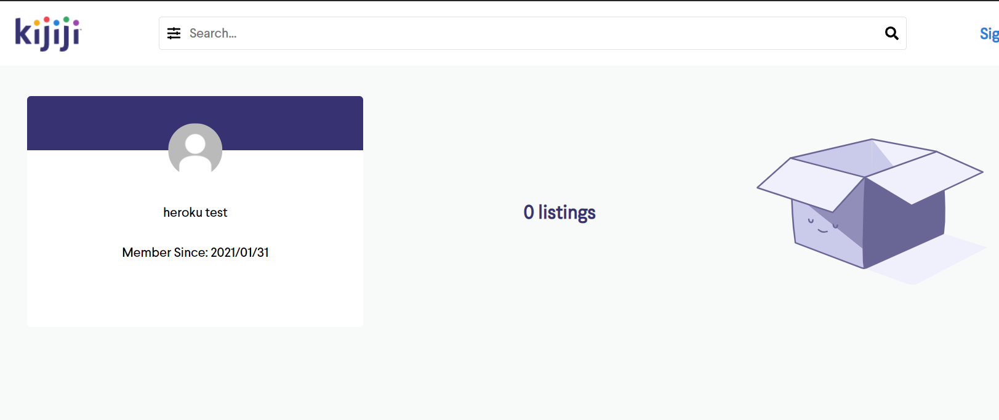
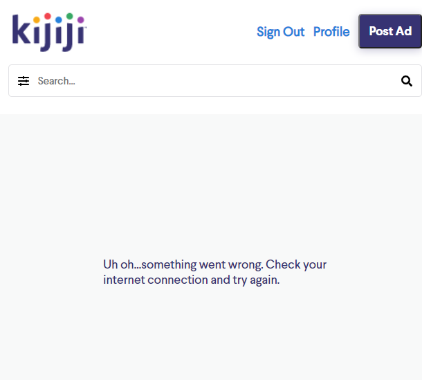

# Kijiji

Replication of [Kijiji website](https://www.kijiji.ca/). Database is created in BCNF (Boyce Codd Normal Form). Authentication is done via cookies that stores access tokens and refresh tokens (JWTs); users can create, edit, delete a listing, and see all listings by other users. Data is stored on PostgreSQL. Developed with React, Redux, Express, Typescript, React-Testing-Library, Jest, JS, HTML, CSS.

Deployment / Production repo: https://github.com/mattfrancis888/heroku-kijiji

### BCNF database graph:


### Why I Built It And What I've Learned:

-   To further understand database normalization (reinforcing the normalization topics covered in Wilfrid Laurier University’s CP363 course).
-   Implementing authentication with access tokens and refresh tokens.
-   To understand the pros and cons of using cookies for authentication
-   Understanding how CORS and cookies are related to CSRF attacks

### PostgreSQL:

-   Refresh Tokens
-   [Full-Text Search](https://www.compose.com/articles/mastering-postgresql-tools-full-text-search-and-phrase-search/). In this project, I used it for the header's search bar that’s used to find listings. When users misspell their searches, the website would still show listings that are similar to the misspelled search.

### The role of cookies in an XSS attack:

With httponly cookies, we receive better security against XSS attacks since HTTP only cookies does not allow javascript to access the session cookie. This is contrary to storing information in localstorage. A localstorage is more vulnerable to XSS attacks because scripts could be used to access the localstorage.

### The role of CORS and cookies in a CSRF attack.

CORS means that a different website can not see the results of any requests made to another site. It does not mean that the request is fully blocked, you just can't read the result.
For example, let's say hacked.com has an attack where it tries to steal your bank info by making a request to bank.com/myinfo. CORS will sufficiently protect from this attack, because when Vic goes on hacked.com, the XSRF request to bank.com/myinfo doesn't necessarily get blocked, but it isn't allowed to see the result, so no information is leaked.

However, imagine that bank.com had some endpoint like bank.com/transfer?to=hacker that would send your money to the hacker. CORS will not sufficiently protect against an XSRF attack in this case, because even though hacked.com isn't able to see the result of the transfer, the transfer still went through. CORS is only blocking hacked.com from seeing the result of the transfer, but not blocking it from falsely starting the transfer.

### How is a CSRF attack that involves a cookie also related to the cookie config of SameSite=Strict?

A cookie being SameSite is absolutely crucial. Let's go back to the last example with bank.com/transfer?to=hacker. The only way that you could actually transfer your money to the hacker is if you were logged in to the bank (otherwise you would be trying to transfer money while not logged in, would obviously not work).
If the cookie that stored your login information to bank.com had SameSite enabled, then when hacked.com kicks off an XSRF request to bank.com, it doesn't include that cookie (cookie is only sent to requests on the same URL). Therefore, the request would go through but it wouldn't do anything because Vic wasn't logged in.

Contrary, a localstorage is much more secure against XSRF attacks because a localstorage is not “shared” between other tabs.

### Why use access tokens and refresh tokens?

An access token expires after a certain amount of time. If an attacker gets the access token, their only opportunity of attack is during the window where the token has not expired yet. A new access token would be granted if the user has the refresh token. Since the refresh token is stored in an httponly cookie with a config of SameSite=Strict, it makes it harder for attackers to get the cookie with XSS and XSRF attacks respectively.

### Access Tokens and Refresh Tokens Flow:

1. When users sign in / register, an access token (that will expire) is given to the user and a refresh token is stored in the database.
2. Access token is stored in a cookie with Secure, SameSite=Strict and Refresh token is stored in an httponly cookie with Secure, SameSite=Strict.
3. When the access token expires, we would get a new access token by using the refresh token. The refresh token would generate a new access token. Before this process is executed, the process is verified by checking if the refresh token in the database matches with the refresh token stored in our httponly cookie; if it matches, the new access token is given.

How 3. Is implemented:
`app.use("/api", authenticateToken)`
in our backend would check if our JWT has expired at every network call. If it expires, it will send a 403 status and `/api/token` (where “/token” represents the refresh token; it handles if a new access token cookie should be created) would automatically be called with our axios interceptors ( calls `/api/token` when there’s an error)

If the refresh token is faked/forged, the request will fail and no new JWT will be given. The user will not be able to access any routes. If the refresh token matches the one in the database, a new access token would be created and the user could continue browsing without being logged out.
To keep the app simple, the refresh token will not expire.

### At the end of the day, does it matter if we store access token in local storage or cookies (with SameSite=Strict, but without httponly)?:

[Does not matter if we store access token in localStorage or cookies in regards to XSS attacks](https://www.youtube.com/watch?v=M6N7gEZ-IUQ&t=639s&ab_channel=BenAwad)

## React:

-   Utilized Axios interceptors to get new access tokens by calling “/api/token” (which grants a new access token if our refresh token in the httponly cookie matches the refresh token in the database)

## External Resources:

-   pgAdmin 4 for PostgreSQL GUI.
-   Postman to test API requests.
-   Prettier to format code and EsLint for linting.
-   Redux dev tool google chrome extension to check the values of the states.

## What It Looks Like














# Getting Started

These instructions will get you a copy of the project up and running on your local machine for development and testing purposes.

1. Clone the project. Use `npm install` to install all the dependencies. Go to the client directory, run the project with `npm start` for development or `npm run build` for production.

2. OPTIONAL: If you want to make changes locally, on the terminal, go to the `backend` directory. Type `npm run convert` to start the local server. The command would also listen to changes and convert the Express Typescript files to Express Javascript files that will be used for production. Create your own local database by restoring the pg_dump file of the kijiji database given (called ‘kijiji’ in root directory). Configure your own Pool settings in databasePool.

# Prerequisites

What things you need to install the software

```
- Any package manager (npm, yarn)
```

# Versioning

None
